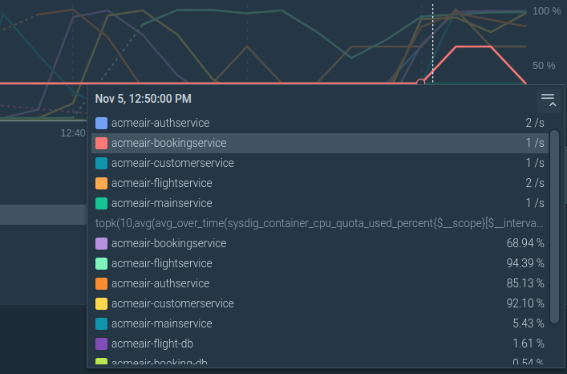
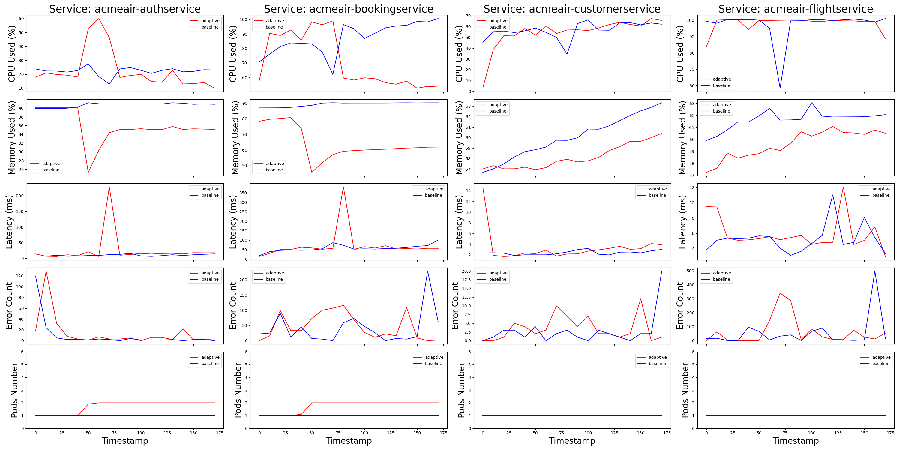

# Self-optimizing Autoscaler For OpenShift
## Overview
The MAPE-K Rule-Based System is a scalable, rule-based analyzer and horizontal scaler developed specifically for AcmeAir, a microservice-based website that facilitates flight bookings. This system is designed to manage uncertainties such as fluctuating web requests and network quality, ensuring reliable service performance in terms of availability and latency while optimizing operational costs.

## Features
* Dynamic Resource Allocation: Adjusts service resources in real-time to handle varying loads without sacrificing performance.
* Cost Optimization: Balances performance with operational costs, adhering to a utility function that considers CPU usage, memory usage, and service availability.
Performance Metrics: Ensures that 99% of requests are completed within 300 ms and maintains a high success rate for customer satisfaction.
* Rule-Based Analysis: Utilizes a rule-based approach to reduce computational overhead while maintaining efficient service configurations.
* Data-Driven Decisions: Employs regression models to predict service performance and necessary adjustments based on real-time data.
* 
## Components
* Monitor: Collects and processes metrics to provide up-to-date knowledge on service performance.
* Analyzer: Evaluates current system state against performance objectives to determine necessary adjustments:
  * Adjust the CPU limit
  * Adjust the memory limit
  * Adjust the number of replicas
  * Adjust the JVM heap memory limit
* Planner: Develops action plans based on analysis while considering cost constraints and efficiency.
* Executor: Implements the action plans, applying changes to the service configuration as needed.
* Knowledge Base: Stores and manages data collected from the system for ongoing analysis and planning. The metrics we collected are:
  
| Knowledge Metrics | Sysdig Metrics                                                                      | Aggregation |
|----------------------------|-----------------------------------------------------------------------------------------------|----------------------|
| CPU Quota Percentage       | $sysdig\_container\_cpu\_quota\_used\_percent$                                                | average by time      |
| Memory Quota Percentage    | $sysdig\_container\_memory\_limit\_used\_percent$                                             | average by time      |
| JVM Heap Quota Percentage  | $jmx\_jvm\_heap\_used\_percent$                                                               | average by time      |
| Latency                    | $sysdig\_container\_net\_request\_time$                                                       | average by time      |
| Success Rate               | $1 - \frac{sysdig\_container\_net\_error\_count}{sysdig\_container\_net\_request\_in\_count}$ | sum by time          |

## Setup and Configuration
### Requirements
Kubernetes, OpenShift Client, Sysdig (for metric collection).

### Configuration
Follow the setup instructions provided in the setup directory to configure your environment and deploy the MAPE-K components.

### Customization
Adjust utility functions, cost parameters, and performance thresholds as per your business requirements and operational goals. The current rules are:
| Condition           | Action  |
|--------------------------------|------------------|
| CPU Quota Percentage < 40\%    | Remove 1 Replica |
| CPU Quota Percentage > 80\%    | Add 1 Replica    |
| Memory Quota Percentage < 40\% | Remove 1 Replica |
| Memory Quota Percentage > 80\% | Add 1 Replica    |
| JVM Quota Percentage > 80\%    | Add 1 Replica    |
| Latency > 300ms                | Add 2 Replicas   |
| Success Rate < 99.5\%          | Add 2 Replicas   |

### Usage
1. Start the MAPE-K loop by executing the main loop script. You can define the interval between iterations according to your needs.
2. Monitor the system's performance through the dashboard provided by Sysdig or your preferred monitoring tool.
3. Update rules and preferences in the Analyzer and Planner modules as needed to adapt to changing business objectives or operational conditions.

## Evaluation
We used JMeter to run the loading experiment twice, one with our MAPE-K implementation, and another one without it. As mentioned in assignment 2, we run the JMeter Load Generator in the same Kubernetes namespace as the target services.  The experiment had 200 threads as the load The CPU quota used percentage of the non-adaptive booking service, customer service and flight services are close to 100\% under the 200 JMeter thread load, requiring scaling. Our experiment ran for 4 minutes for each case. We discard the beginning and the last 30 seconds of the metrics of the experiment, to extract more stable metrics.

*Figure 1: The authentication service and flight services are
scaled to 2 replicas for high CPU Usage.*

As  Figure 2 shows, the red line indicates the metrics from the adaptive method and the blue line shows the trend of the baseline services. The bottom row of plots in Figure 2 shows replica numbers. Only the authentication and booking service were adapted to this load level.

In the case of booking service (the 2nd Column in Figure 2), the memory used percentage reacts drastically to the changing of pod numbers, with the saturation dropping around 50\% when a new pod is deployed. , the CPU utilization decreased by around 50\% when one more pod was added. Compared to the baseline trend, our MAPE-K implementation did help the booking service. However, despite the dropping percentage in CPU and memory, the latency and error counts show no significant difference. We haven't figured out the reason behind this anomaly.

Though our horizontal scaling implementation helped the booking service, there are anomalies for other services. For example, for both the customer service and the flight service, the scaling didn't happen under the 200 JMeter threads load. There remains only one replica in their deployments. This could be attributed to the fact that their CPU used Quota Percentage didn't reach the threshold for adaptation. In our case, this threshold is 80\%. Thus, in the 3rd column and 4th column in Figure 2, the trends in CPU utilization, error counts and latency of the adaptive and the baseline are similar.

The authentication service is scaled from one pod to two. However, only the Memory Quota Percentage dropped, while their CPU Quota Percentage resembled. One possible ex plantation could be that the success rate condition triggered the adaptation of adding one replicas. The CPU and memory of one pod is already sufficient for this load level. 

*Figure 2: Pod number and the "Golden" Metrics for Adaptive(Red) and Non-Adaptive(Blue) Services*

## Lessons Learned
Horizontal scaling is most effective at the deployment level for managing resource utilization and service performance.
Adaptation delay and threshold settings are critical to avoiding unnecessary scaling actions and ensuring timely responses to changing conditions.
Future enhancements include the development of a Markov Decision Process model to improve prediction accuracy and decision-making processes.

## License
This project is licensed under the MIT LICENSE. See the LICENSE file for details.

## Acknowledgments

We would like to thank IBM to provide us the computational resources to develop and test this system. We would also like to thank our professor Landan and the TAs.

